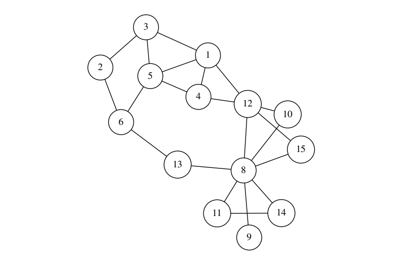

# New Friends Recommendation on Social Networks
One of the main functionalities offered by online social platforms such as Facebook and Twitter is the recommendation of new friends.
**The project shows the process and implementation of new friends recommendation on social networks, by the usage of several data structures**. This is achieved by utilizing various information about the users, but the main factor used for recommending a new friend to a user is how well these two users are connected.

# Objective
**A social network such as Facebook can be represented as an undirected graph** such as the one shown in the figure below. We can use the information contained in the graph to select the top candidate friends for a given user. There are many ways to do this, but we will focus on two methods:

1. **Popular users**: In this method, we recommend the most popular users in the graph, that is nodes with the highest degrees (number of neighbors).
   
    **Example 1.** In the graph below, if we want to recommend 4 new friends for user 3 using the popular users method, we recommend: 

        (a) User 8, which has degree 7.
        (b) User 12, which has degree 5.
        (c) User 4, which has degree 3.
        (d) User 6, which has degree 3 (we break ties according to user ID).

2. **Common neighbors**: In this method, we recommend users who have the most common friends with the user.
   
    **Example 2.** In the graph below, if we want to recommend 4 new friends for user 3 using the common neighbors method, we recommend:

        (a) User 4, which has 2 common neighbors with 3, nodes 1 and 5.
        (b) User 6, which has 2 common neighbors with 3, nodes 2 and 5.
        (c) User 12, which has 1 common neighbor with 3, node 1.
        (d) User 8, which has 0 common neighbors with 3 (we break ties according to user ID).

# Program Structure
The program is divided into multiple components, which are:
1. **A top k priority queue**: To recommend top k users, we use a priority queue that keeps only the top k elements and serves them in decreasing order of priority.
2. **A map**: The map interface will be implemented in the binary search tree (BST) context.
3. **The social network**: It will be represented as a friendship graph. We will use adjacency list representation, but instead of an array of lists, we use a map of lists. Each list in the map represents the neighbors of a node.
4. **The friends recommender**: That would be implemented in the class Recommender that implements the two friends recommendation methods discussed above.

- Finally, the structure of the social network (Which user (node) is connected with who) is given in a [**text file**](Code/graph.txt). Also, the expected output after running the program -The output of Main class- could be found [**here**](Code/MainOutput.txt).

--- 
**Example Figure of a Graph Representing a Social Network:**

